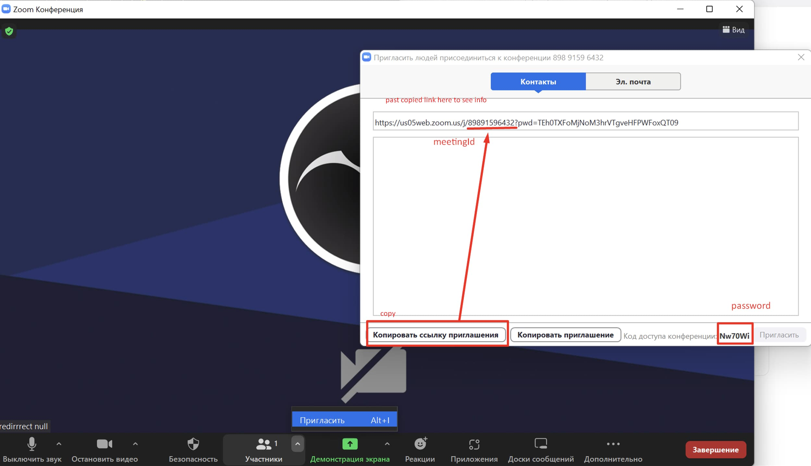

# Zoom WEB custom timer 

### `npm i`

### `npm start`

Runs the app in the development mode.\
Open [http://localhost:3000](http://localhost:3000) to view it in your browser.

Onload web app you can see prompt. For correct working, enter meeting number and meeting password and join to meeting room. 

Example where you can get meeting number and meeting password: 

### Problems
Before correct watching this progect sometimes you may to register Chrome Origin Trial [instruction](https://marketplace.zoom.us/docs/sdk/overview/websdk-gallery-view/#implementing-chrome-origin-trials)

Zoom documentation - [https://marketplace.zoom.us/docs/sdk/native-sdks/web/build/](https://marketplace.zoom.us/docs/sdk/native-sdks/web/build/)

You can change ZOOM API keys in `.env`
